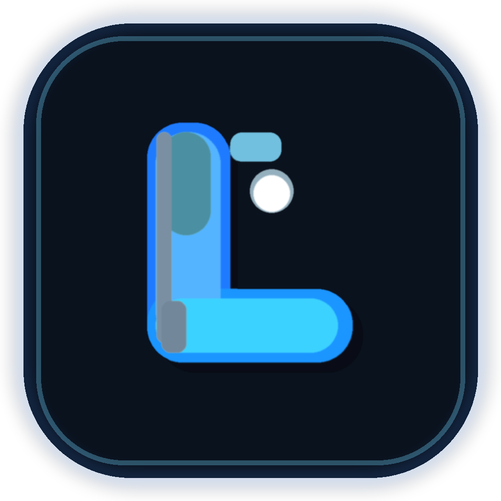

<p align="center">
  
</p>

# LocalLLM — Offline LLM Chat (Expo + llama.rn)

[](https://github.com/kumarAvinash108/LocalLLm/actions/workflows/android-apk.yml)

Chat with open-weight LLMs **fully on-device**. Download a `.gguf` model from
Hugging Face once, then chat offline — no server, no API key, no data leaves
your phone.

## 📲 Install on Android (easiest)

Download the latest APK from
[**Releases → `latest`**](https://github.com/kumarAvinash108/LocalLLm/releases/tag/latest),
install it on a physical device, then open **Models → Download → Load in Chat**.
Every push to `main` triggers a fresh build, so the APK is always up to date.
Expo Go is **not** supported (the app needs native llama.cpp code).

- **Engine:** [`llama.rn`](https://github.com/mybigday/llama.rn) (llama.cpp binding, MIT)
- **App:** Expo SDK 57 + React Native New Architecture
- **Storage:** `expo-file-system` for `.gguf` weights, `expo-sqlite` kv-store for chats/settings
- **License:** MIT — see [`LICENSE`](./LICENSE); third-party notices in
  [`THIRD-PARTY-NOTICES.md`](./THIRD-PARTY-NOTICES.md)

## How it works

```
Hugging Face (one-time download)      On-device (offline forever after)
───────────────────────────────       ────────────────────────────────
Models screen → pick a GGUF     ──►   expo-file-system stores .gguf
  (e.g. Qwen 2.5 0.5B Q4_K_M)         in app documents (/localllm-models)
         │
         ▼
"Load in Chat" → llama.rn initLlama() maps weights into memory
         │
         ▼
Chat screen → llama context.completion({ messages }) streams tokens
```

Key files:

| Path | Role |
|---|---|
| `src/data/models.ts` | Curated GGUF catalog (default: Qwen 2.5 0.5B Q4_K_M) |
| `src/services/huggingface.ts` | `https://huggingface.co/<repo>/resolve/main/<file>` URL builder + `.gguf` repo browser via HF Hub API |
| `src/services/modelDownloader.ts` | Resumable download with progress/cancel into app documents (uses `expo-file-system/legacy`) |
| `src/services/llm.ts` | Singleton owner of the native `LlamaContext` (load/unload/streaming completion/stop) |
| `src/context/ModelContext.tsx` | Download/load state for the UI (progress, errors, persistence) |
| `src/context/ChatContext.tsx` | Chat history + streaming inference (calls `llm.chatCompletion`) |
| `src/screens/ModelScreen.tsx` | Download → Load → Chat UI, incl. custom repo/file + `.gguf` browser |
| `src/components/ModelBanner.tsx` | "No model loaded" banner in chat |

## Prerequisites

- Node 20+, npm
- **Custom dev build is required** — llama.rn ships native code, so
  **Expo Go is NOT supported**:
  ```sh
  npm install
  npx expo prebuild        # generates android/ ios/
  npx expo run:android     # or run:ios
  ```
- For iteration after the first native build: `npx expo start --dev-client`
- Physical device recommended (emulators work but are slow; models need
  1–3 GB free RAM depending on size).

## Quick start

```sh
npm install
npx expo prebuild
npx expo run:android   # or: npx expo run:ios
```

Then in the app:

1. Tap the **chip icon** in the header (or menu → **Models**).
2. Tap **Download** on *Qwen 2.5 0.5B Instruct (Q4_K_M)* (~ mid-hundreds MB).
3. Tap **Load in Chat** — wait for "Loaded in chat".
4. Go back and start chatting. Fully offline from here on.

### Custom Hugging Face model

In **Models → Custom Hugging Face model**:

- Enter `owner/name` (e.g. `bartowski/Qwen2.5-1.5B-Instruct-GGUF`),
- Tap **Browse .gguf files** to list candidates (prefers `Q4_K_M`),
  or type the filename directly (must end in `.gguf`),
- Tap **Download**, then **Load in Chat**.

Rules: public repos only; URL pattern is
`https://huggingface.co/<repo>/resolve/main/<file>`. Gated repos
(e.g. original `meta-llama/*`) require license acceptance in a browser —
use `bartowski/*-GGUF` mirrors instead.

## Configuration

- **Context size:** `n_ctx: 2048` default in `src/services/llm.ts` (`loadModel` call in `ModelContext`). Raise for longer memory at the cost of RAM/speed.
- **Temperature / max tokens:** `Settings` screen persists `temperature` / `maxTokens`; `ChatContext` passes them to every completion (`n_predict`).
- **Catalog:** edit `src/data/models.ts` to add/remove curated entries.

## Model licenses (important)

This repo's MIT license covers **the app code only**. Downloaded weights
keep their own licenses (Apache-2.0, Llama Community License, etc. —
noted per entry in `src/data/models.ts`). Review the license on the
model's Hugging Face page before downloading.

## Troubleshooting

| Symptom | Fix |
|---|---|
| "No model is loaded yet" in chat | Open Models → Download → **Load in Chat** |
| Download HTTP 404 | Wrong repo/file spelling; use **Browse .gguf files** |
| 401/403 on lookup | Gated/private repo — use a public `*-GGUF` mirror |
| Load fails / app killed | Model too big for device RAM — try the 0.5B or 360M model |
| "Missing JSI bindings" / native crash | Rebuild the dev client (`npx expo prebuild && run:`); Expo Go won't work |
| Slow tokens | Expected on CPU; smaller quants (`Q4_K_M`) and shorter `maxTokens` help |

## Scripts

| Command | Purpose |
|---|---|
| `npm start` | Start Metro (dev-client only; needs native build) |
| `npm run android` / `npm run ios` | Start + open platform |
| `npx tsc --noEmit` | Typecheck |

## License

MIT © 2026 LocalLLM Contributors — see [`LICENSE`](./LICENSE).
Dependency licenses: [`THIRD-PARTY-NOTICES.md`](./THIRD-PARTY-NOTICES.md).

## Contributing

PRs welcome — please read [`CONTRIBUTING.md`](./CONTRIBUTING.md) first
(dev build required, quality gates, and how releases work).
